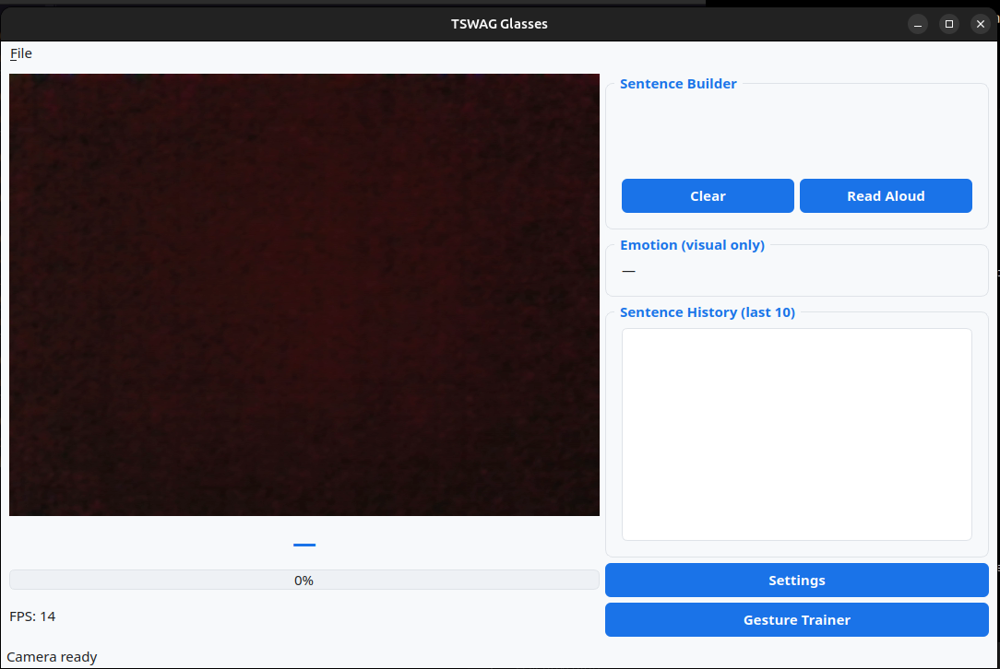
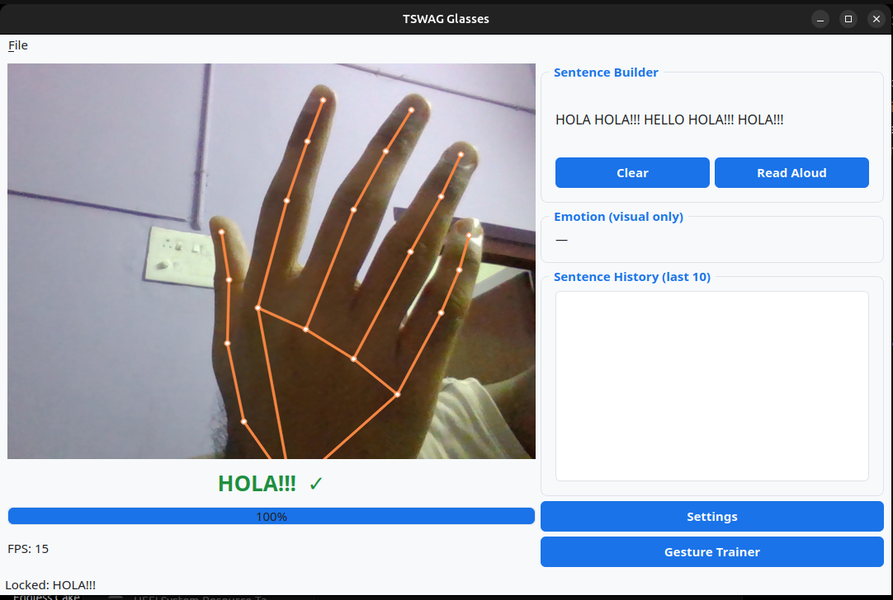
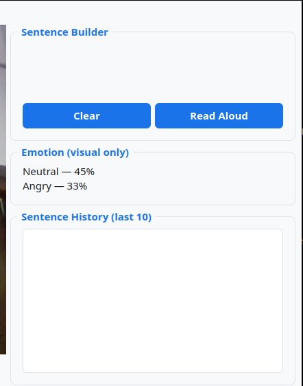
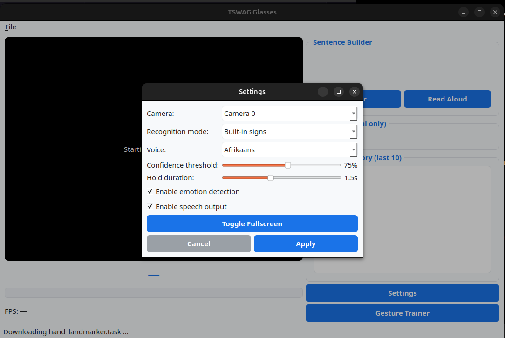
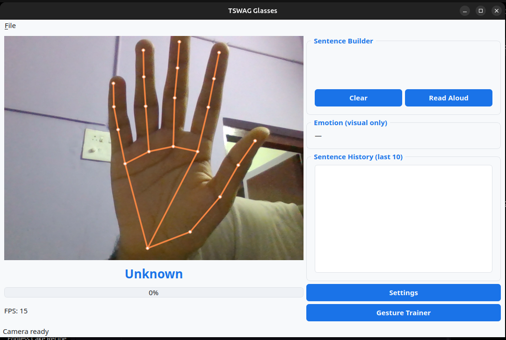

# 🕶️ SWAG Glasses

A lightweight offline desktop application that converts **trained hand gestures into spoken English** using a webcam.

SWAG Glasses combines real-time **hand tracking**, **face tracking**, **gesture recognition**, **offline text-to-speech**, and **emotion detection** into an easy-to-use desktop application.

> **Note:** This is **not a complete sign language translator**. The application is designed around **custom-trained gestures** with a small built-in gesture set for demonstration.

---

# ✨ Features

* 🎥 Real-time webcam feed
* ✋ Hand tracking
* 😀 Face tracking
* 🧠 Custom gesture trainer
* 🤖 Built-in gesture recognition
* 🗣️ Offline text-to-speech
* 😊 Emotion detection overlay
* 📈 Recognition progress indicator
* 📝 Live sentence builder
* 📖 Read complete sentence aloud
* ⚙️ Settings panel
* 📷 Camera selector
* 🖥️ Fullscreen support

---

# 📸 Screenshots

## 🏠 Home Screen

Displays the live webcam feed along with gesture recognition, hand tracking, face tracking, and sentence builder.



---

## ✋ Real-Time Hand Tracking

Tracks one or two hands using MediaPipe landmarks.


---

## 😀 Face Tracking

Tracks facial landmarks in real time.


---

## 🎯 Gesture Recognition

Hold a gesture for approximately **1.5 seconds**.

The application:

* Detects the gesture
* Locks the recognized word
* Speaks it aloud
* Adds it to the sentence



---

## 😊 Emotion Detection

Displays the top two detected facial emotions.

This feature is **visual only** and does not affect gesture recognition.


---

## 📝 Sentence Builder

Recognized words are combined into a sentence.

Raise both hands with open palms for approximately **2 seconds** and the application asks whether to read the complete sentence aloud.



---

## 🎓 Gesture Trainer

Create your own gestures without writing any code.

The trainer allows you to:

* Record gesture samples
* Save gestures
* Retrain recognition
* Delete gestures


---

## ⚙️ Settings

Configure:

* Camera selection
* Recognition mode
* Voice
* Confidence threshold
* Hold duration
* Emotion detection
* Speech output
* Fullscreen mode



---

# 🧠 Built-in Words

The application includes a small built-in vocabulary:

* USE
* TECHNOLOGY
* FOR
* HELP
* NOT
* WAR

Users can also train unlimited custom gestures.

---

# 📦 Requirements

* Python 3.12+
* Webcam
* Windows or Linux
* Internet connection (first launch only)

---

# 🚀 Installation

Clone the repository:

```bash
git clone https://github.com/govind0911/sign-to-speech.git
```

Go into the project folder:

```bash
cd sign-to-speech
```

Run the application:

Linux

```bash
python3 main.py
```

Windows

```bash
python main.py
```

---

# 🔧 First Launch

On the first launch, the application automatically:

* Installs missing Python packages
* Downloads MediaPipe models
* Initializes offline speech synthesis
* Opens the webcam

The first launch may take a minute depending on your internet connection.

---

# 🎓 Training Custom Gestures

The application works best after training your own gestures.

### Step 1

Open **Gesture Trainer**.

### Step 2

Enter the name of the gesture.

Example:

```
HELLO
```

### Step 3

Hold the gesture in front of the webcam.

### Step 4

Click **Record**.

### Step 5

Record the same gesture multiple times from different angles for improved accuracy.

### Step 6

Click **Retrain**.

Your gesture is now ready to use.

---

# ▶️ How to Use

1. Launch SWAG Glasses.
2. Choose your webcam.
3. Select Built-in Mode or Custom Mode.
4. Hold a gesture steady for approximately **1.5 seconds**.
5. The application recognizes and speaks the word.
6. Continue building a sentence.
7. Raise both hands with open palms for approximately **2 seconds**.
8. Choose whether to read the complete sentence aloud.
9. Optionally clear the sentence afterward.

---

# 💡 Tips for Better Recognition

* Use good lighting.
* Keep both hands inside the frame.
* Avoid busy backgrounds.
* Hold gestures steadily.
* Train each gesture several times.
* Record gestures from different positions and angles.

---

# 📂 Project Structure

```text
sign-to-speech/
│
├── screenshots/
│   ├── home.png
│   ├── hand_tracking.png
│   ├── face_tracking.png
│   ├── recognition.png
│   ├── emotion.png
│   ├── sentence.png
│   ├── trainer.png
│   └── settings.png
│
├── main.py
├── engine.py
├── gestures.py
├── README.md
└── .gitignore
```

---

# 🛠️ Technologies Used

* Python
* PyQt6
* OpenCV
* MediaPipe
* NumPy
* pyttsx3

---

# ⚠️ Current Limitations

* Not a full sign language translation system.
* Optimized for custom-trained gestures.
* Limited built-in vocabulary.
* Recognition quality depends on lighting, camera quality, and training data.

---

# 🚀 Future Improvements

* Larger gesture vocabulary
* Continuous gesture recognition
* Better machine learning models
* Support for additional sign languages
* Improved training accuracy
* Faster inference

---

# 🤝 Contributing

Contributions are welcome. Feel free to fork the project, open issues, or submit pull requests.

---

# 📄 License

This project is licensed under the MIT License.

---

⭐ **If you found this project useful, consider giving it a star on GitHub!**
APPLICATION SNAPSHOTS
# Application UI

This is how **SWAG Glasses** works.

## Home Screen

Displays the live webcam feed, hand tracking, face tracking, recognition progress, and the sentence builder.


---

## Hand & Face Tracking

Tracks both hands and the user's face in real time using MediaPipe.



---

## Gesture Recognition

Hold a trained gesture steady for approximately **1.5 seconds** to recognize and speak the corresponding word.


---

## Emotion Detection

Shows the top two detected facial emotions as a visual overlay.


---

## Gesture Trainer

Record custom gestures, retrain the recognition model, and manage saved gestures.


---

## Settings

Configure the camera, recognition mode, voice, confidence threshold, and other application settings.


---

## Sentence Builder

Recognized words are combined into a sentence. Raising both hands with open palms prompts the application to read the sentence aloud.


